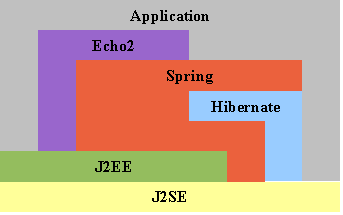
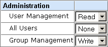
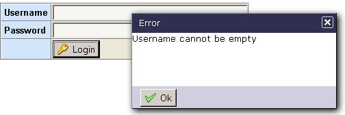
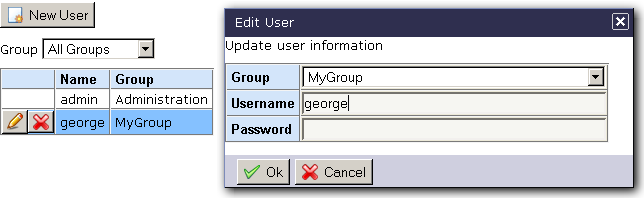
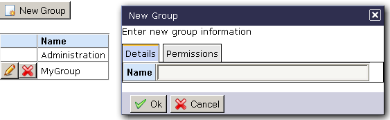

Hibernate, Spring, Echo2 Base Application
=========================================

Archived on GitHub. Original (from 2006): http://hse.sourceforge.net/

Introduction
------------

This project is designed as a base application and guide for building AJAX applications using Hibernate, Spring, and Echo2. It is intentionally left sparse (It contains only a group and user editor) so that it can be used as a base for a full blown application.

Features
--------

### Hibernate, Spring, Echo2 integration:

All three technologies are matched cohesively together to provide a robust base for your AJAX applications.

### 3-Tier Architecture:

Follows the established pattern of separating the application into data, business, and user-interface
tiers.

### Security:

* Allows username/password logon, logoff, and permission checking.
* Permissions can be queried using hasPermission(), or enforced using requirePermission().
* Enforcement is done in the business tier.

### Group-based Permission System:

* Permissions are group based, which means that users gain permissions based on their group membership (A
user can be a member of only one group).
* Groups can have multiple permissions, and associate levels for each permission.

The base application uses two methods for interpreting permission levels:

* Access based: 0 = DENY, 1 = ALLOW
* Read/Write based: 0 = NONE, 1 = READ, 2 = WRITE

### Input Validation:

A simple and flexible validation system that can handle most common input field validations.

The custom screen and requestor components can display validation error alerts, and can automatically set focus to the offending input field.

### User Editor:

Example on-screen CRUD editor allowing modification of user properties, as well as group membership.

### Group Editor:

Example on-screen CRUD editor allowing modification of group properties, as well as assigning permission levels.

Running HSE
-----------

### Requirements:

* Java 1.4
* A servlet container such as [Tomcat](http://tomcat.apache.org/)

### Download:

HSE can be downloaded from http://sourceforge.net/projects/hse

NOTE: hse.war is a build of the application for those who want to play with it first. The default 
username/password is admin/adminchangeme
